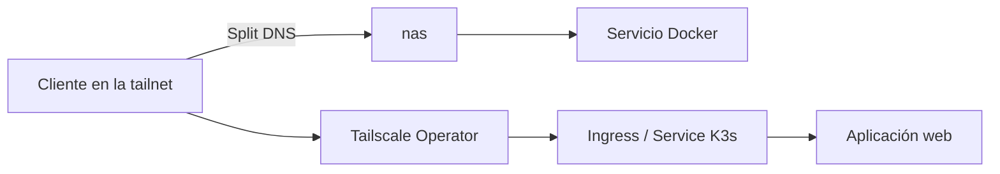
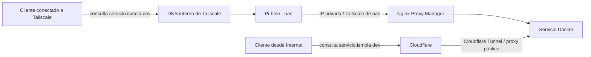
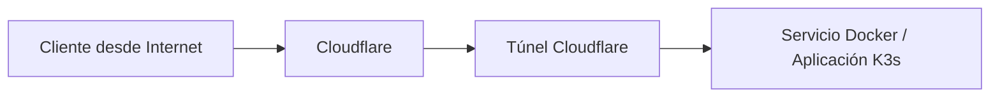
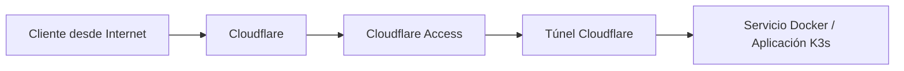

# 🏠 Homelab

**Infraestructura híbrida, privada por diseño y gestionada como código**

Esta es la solución que uso: combinar hardware propio la capa gratuita de distintos proveedores cloud, conectándolo todo mediante [Tailscale](https://tailscale.com/).

Inventario de servidores: [`ansible/inventory/inventory.yml`](ansible/inventory/inventory.yml)

Hay varias servidores conectados por tailscale formando un cluster [k3s](https://k3s.io/) y un NAS corriendo varios servicios docker. la mayoría de los servicios corren en el cluster k3s, pero algunos servicios que requieren acceso a almacenamiento local corren en el NAS.

```mermaid
flowchart TB
    client["Clientes"]
    internet["Internet<br/>Cloudflare"]
    tailnet(("Tailscale<br/>tailnet"))
    r2[("Cloudflare R2<br/>Object Storage")]
    workloads["Workloads K3s"]
    longhorn[("Longhorn<br/>Persistent Volumes")]
    databases[("PostgreSQL · MongoDB")]

    subgraph provider_homelab["Homelab"]
        docker_h0["h0 · NAS<br/>Docker workloads"]
        k3s_rpi["rpi<br/>K3s server / worker"]
    end

    subgraph provider_google["Google Cloud"]
        k3s_v4["v4<br/>K3s agent / worker"]
    end

    subgraph provider_oracle["Oracle Cloud"]
        k3s_v3["v3<br/>K3s server / worker"]
        k3s_v7["v7<br/>K3s server / worker"]
        k3s_instance_20240424_2202["instance-20240424-2202<br/>K3s agent / worker"]
        k3s_v2["v2<br/>K3s agent / worker"]
        k3s_v5["v5<br/>K3s agent / worker"]
        k3s_v6["v6<br/>K3s agent / worker"]
    end

    subgraph docker_deployments["Docker Compose · h0"]
        compose_cloudflare["cloudflare<br/>cloudflared"]
        compose_media["media<br/>qbittorrent · jackett · radarr · sonarr · bazarr · prowlarr · plex · seerr · qbit_manage"]
        compose_networking["networking<br/>pihole · npm"]
        compose_immich["immich<br/>immich-server · immich-machine-learning · redis · database"]
        compose_opencloud["opencloud<br/>opencloud"]
        compose_duplicati["duplicati<br/>duplicati"]
        compose_gickup["gickup<br/>gickup"]
        compose_pgbackup["pgbackup<br/>pgbackups"]
        compose_minio["minio<br/>minio"]
    end

    subgraph k3s_deployments["Aplicaciones GitOps · K3s"]
        gitops_african_art_exhibition_concept["african-art-exhibition-concept"]
        gitops_apple_concept["apple-concept"]
        gitops_argocd["argocd"]
        gitops_argocd_image_updater["argocd-image-updater"]
        gitops_cakeshop_concept["cakeshop-concept"]
        gitops_calendar_subscription_hub["calendar-subscription-hub"]
        gitops_cloudflare["cloudflare"]
        gitops_etcd_backup["etcd-backup"]
        gitops_gateway_api_crds["gateway-api-crds"]
        gitops_gateway_system["gateway-system"]
        gitops_gott_calculator["gott-calculator"]
        gitops_headlamp["headlamp"]
        gitops_homepage["homepage"]
        gitops_japon_landing_concept["japon-landing-concept"]
        gitops_js_snake["js-snake"]
        gitops_jw_hitster["jw-hitster"]
        gitops_longhorn["longhorn"]
        gitops_mongodb["mongodb"]
        gitops_monitoring["monitoring"]
        gitops_open_date["open-date"]
        gitops_portfolio["portfolio"]
        gitops_postgres["postgres"]
        gitops_pro_login_animacion["pro-login-animacion"]
        gitops_sj_wedding["sj-wedding"]
        gitops_tailscale["tailscale"]
        gitops_template_next["template-next"]
        gitops_trivial_php["trivial-php"]
        gitops_zip_hider["zip-hider"]
    end

    client -->|"servicios públicos"| internet
    internet --> workloads
    client -->|"acceso privado / Split DNS"| tailnet
    internet --> docker_h0
    tailnet --- docker_h0
    docker_h0 --> docker_deployments
    tailnet --- k3s_v3
    k3s_v3 -.-> workloads
    tailnet --- k3s_v7
    k3s_v7 -.-> workloads
    tailnet --- k3s_rpi
    k3s_rpi -.-> workloads
    tailnet --- k3s_instance_20240424_2202
    k3s_instance_20240424_2202 -.-> workloads
    tailnet --- k3s_v2
    k3s_v2 -.-> workloads
    tailnet --- k3s_v4
    k3s_v4 -.-> workloads
    tailnet --- k3s_v5
    k3s_v5 -.-> workloads
    tailnet --- k3s_v6
    k3s_v6 -.-> workloads
    workloads --> k3s_deployments
    workloads --> databases
    databases --> longhorn
    gitops_longhorn -->|"Backups S3"| compose_minio
    gitops_etcd_backup -->|"Snapshots S3"| compose_minio
    workloads -->|"API S3"| r2
```

<!-- inventory-diagram:start -->

<!-- inventory-diagram:end -->

### Almacenamiento

La infraestructura combina tres tipos de almacenamiento.

| Capa | Uso |
| :--- | :--- |
| Longhorn + Bases de Datos | Volúmenes persistentes replicados en [Longhorn](gitops/apps/longhorn/README.md) (K3s) para [PostgreSQL](gitops/apps/postgres/README.md), [MongoDB](gitops/apps/mongodb/README.md) |
| `nas` | [Documentos](docker/opencloud/compose.yml), [imágenes](docker/immich/compose.yml), y [copias de seguridad de Longhorn](gitops/apps/longhorn/README.md)  y [etcd](gitops/apps/etcd-backup/cronjob.yaml) guardadas en [Minio](docker/minio/README.md) |
| Cloudflare R2 | Almacenamiento de objetos |

## Red y resolución DNS

Todos los equipos —incluidos `nas` y los nodos K3s definidos en el inventario— están conectados por [Tailscale](https://tailscale.com/). Así, la comunicación interna no depende de que los nodos compartan proveedor o red física.

Combinando [Cloudflare Tunnels](https://developers.cloudflare.com/tunnel/) + [Cloudflare Control Access](https://www.cloudflare.com/sase/products/access/) + [Tailscale](https://tailscale.com/), tengo acceso a servicios de forma pública, pública pero con control de acceso oauth y totalmente privada desde tailscale

### Acceso privado por [Tailscale](https://tailscale.com/)

| Plataforma | Método de acceso |
| :--- | :--- |
| Aplicaciones web de K3s | Entrada privada publicada en la tailnet por el [Tailscale Operator](gitops/apps/tailscale/README.md) |
| Aplicaciones corriendo en el NAS | Conexión directa mediante [Split DNS](#split-dns) |

### Split DNS

Esto hace que un dominio resuelva a una IP pública desde Internet y a una IP privada desde la tailnet. Da acceso publico a los servicios, pero permite que los clientes conectados a la tailnet accedan a ellos de forma privada y más rápida. Útil en servicios que manejan grandes cantidades de datos, como servicios de [streaming](docker/media/compose.yml) o [almacenamiento](docker/opencloud/compose.yml).

Los servicios configurados usan una ruta rápida dentro de Tailscale, mientras conservan su acceso público. [Pi-hole y Nginx Proxy Manager](docker/networking/compose.yml) resuelven y enrutan el tráfico local desde `nas`.

Solo afecta a los nombres configurados; el resto usa el DNS público.

### Acceso público

Se corre un túnel de Cloudflare en [`nas`](docker/cloudflare/compose.yml) para exponer los servicios públicos y otro en el cluster [`K3s`](gitops/apps/cloudflare/deployment.yaml) para exponer las aplicaciones web. La configuración de los túneles se encuentra en los respectivos archivos de composición.

### Acceso público con control de acceso OAuth

Basicamente es activar Cloudflare Access en el túnel de Cloudflare. Esto hace que los servicios sean públicos, pero requieran autenticación OAuth para acceder a ellos. La configuración de los túneles se encuentra en los respectivos archivos de composición.

## Agradecimientos

Gracias a [Tailscale](https://tailscale.com/) por simplificar la red privada que conecta todos los nodos, [GCP](https://console.cloud.google.com/?pli=1) y [Oracle Cloud](https://www.oracle.com/cloud/) por proporcionar parte de la infraestructura sobre la que funciona este homelab.

---

Aprender es lo mejor ❤️

