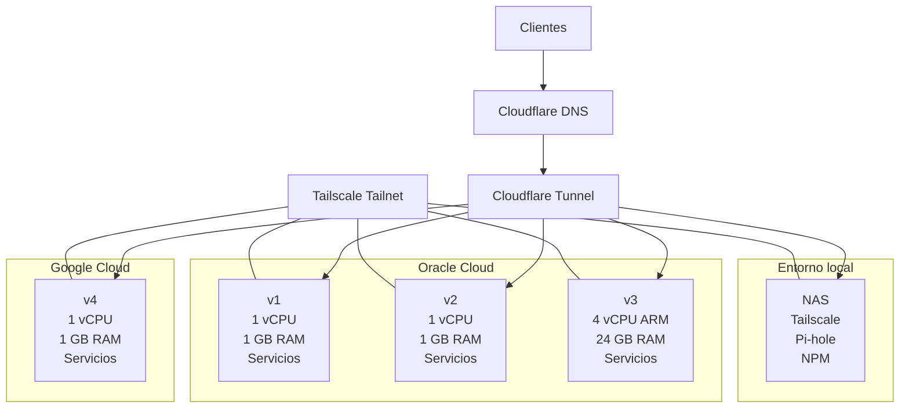
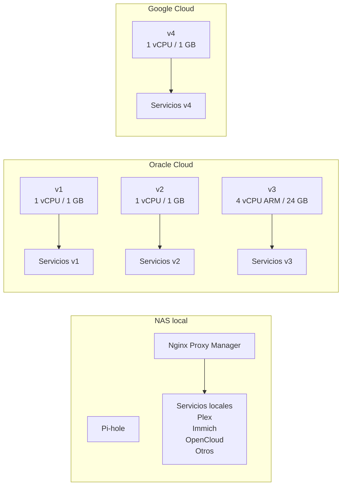
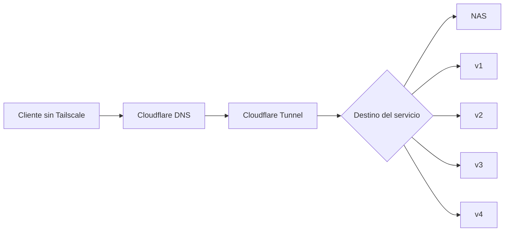
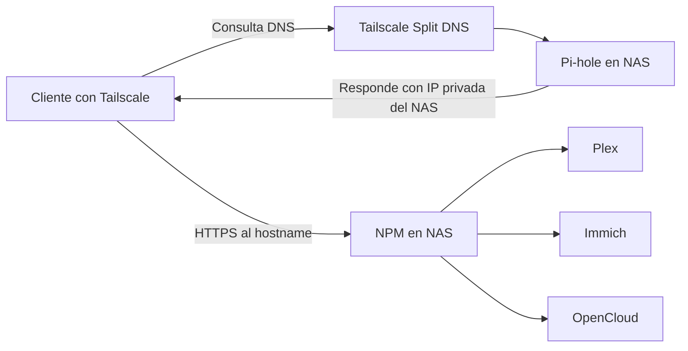
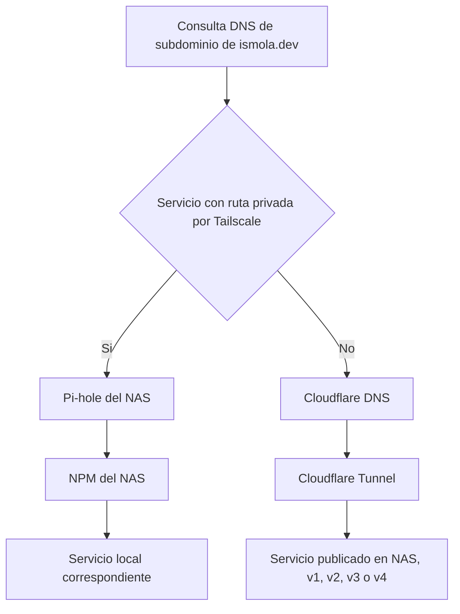

# Infraestructura De Red Y Servidores

Esta documentación se reinicia desde cero y describe la topología actual de la infraestructura.

El objetivo es tener una base clara para reconstruir la red, los servidores y las rutas de acceso privadas y públicas.

## Resumen

- Hay 4 VPS en la nube: `v1`, `v2`, `v3` y `v4`.
- `v1`, `v2` y `v3` están en Oracle Cloud.
- `v4` está en Google Cloud.
- Todas las VPS tienen Tailscale.
- El NAS local también tiene Tailscale.
- En el NAS corren además Pi-hole y Nginx Proxy Manager.
- Todas las VPS corren servicios accesibles en local por Tailscale y en público por Cloudflare Tunnel.
- Solo `plex.ismola.dev`, `immich.ismola.dev` y `opencloud.ismola.dev` usan Split DNS.

## Inventario De Nodos

| Nodo | Ubicación / proveedor | CPU | RAM | Componentes base | Notas |
|------|------------------------|-----|-----|------------------|-------|
| `nas` | Local | No documentado aquí | No documentado aquí | Tailscale, Pi-hole, NPM | Entrada local de los servicios con Split DNS |
| `v1` | Oracle Cloud | 1 vCPU | 1 GB | Tailscale, servicios | VPS general |
| `v2` | Oracle Cloud | 1 vCPU | 1 GB | Tailscale, servicios | VPS general |
| `v3` | Oracle Cloud ARM | 4 vCPU | 24 GB | Tailscale, servicios | Nodo con más capacidad |
| `v4` | Google Cloud | 1 vCPU | 1 GB | Tailscale, servicios | VPS general |

## Principios De Diseño

1. Todos los nodos forman parte de la misma tailnet de Tailscale.
2. Toda la exposición pública de servicios pasa por Cloudflare Tunnel.
3. El NAS actúa como punto de entrada local para los servicios con Split DNS.
4. Pi-hole resuelve los hostnames privados que deben entrar por el NAS.
5. Nginx Proxy Manager enruta localmente por hostname hacia el servicio correcto.
6. Solo tres hostnames usan Split DNS: `plex.ismola.dev`, `immich.ismola.dev` y `opencloud.ismola.dev`.
7. El resto de subdominios de `ismola.dev` deben seguir entrando por Cloudflare si no se añaden explícitamente al DNS privado.

## Alcance Del Split DNS

El Split DNS no aplica a toda la zona `ismola.dev`.

Aplica solo a estos hostnames:

- `plex.ismola.dev`
- `immich.ismola.dev`
- `opencloud.ismola.dev`

Esto implica que:

- Un cliente con Tailscale que consulte uno de esos tres nombres debe entrar por la ruta local del NAS.
- Un cliente con Tailscale que consulte otros subdominios de `ismola.dev` debe seguir resolviendo por Cloudflare, salvo que se configure lo contrario.

## Diagrama 1. Mapa Global De Infraestructura

## Diagrama 2. Vista De Servidores

## Diagrama 3. Ruta Pública De Acceso

Todas las VPS y el NAS pueden publicar servicios de forma pública por Cloudflare Tunnel.

## Diagrama 4. Ruta Privada Con Split DNS

Solo `plex.ismola.dev`, `immich.ismola.dev` y `opencloud.ismola.dev` siguen esta ruta.

## Diagrama 5. Decisión De Resolución DNS

Este es el comportamiento esperado para los subdominios de `ismola.dev`.

## Modelo De Acceso

### Acceso local

- Todos los nodos son accesibles dentro de la red privada mediante Tailscale.
- Los servicios con Split DNS entran por el NAS y por NPM.
- El resto de servicios pueden seguir accediéndose por Tailscale usando IP, MagicDNS o la forma local que definas para cada nodo.

### Acceso público

- Los servicios públicos entran por Cloudflare.
- Cloudflare Tunnel entrega el tráfico al nodo que aloja el servicio.
- Ese nodo puede ser el NAS, `v1`, `v2`, `v3` o `v4`.
