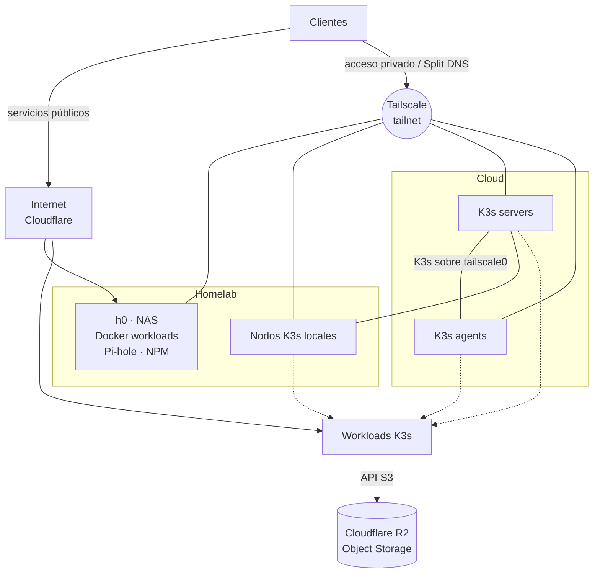
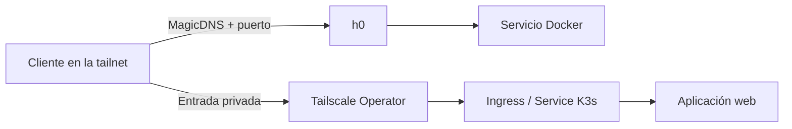
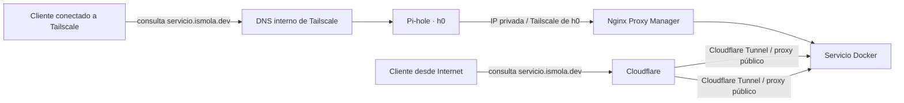
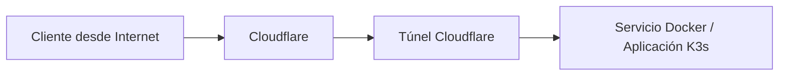

# 🏠 Homelab

**Infraestructura híbrida, privada por diseño y gestionada como código**

Docker en el NAS · K3s multicloud · GitOps · Ansible · Tailscale

---

## Vista general

Homelab híbrido con servicios públicos y privados, almacenamiento y cómputo local y en la nube, y clúster K3s multicloud. La infraestructura se gestiona como código mediante Ansible y GitOps.

La idea, es aprovechar la capa gratuita de los distintos proveedores de nube y usar infraestructura local, para obtener un entorno de desarrollo y pruebas con alta disponibilidad y tolerancia a fallos, sin depender de un único proveedor ni de una única red física y lo más económico posible.

## Infraestructura

Inventario: [`ansible/inventory/inventory.yml`](ansible/inventory/inventory.yml)

### Almacenamiento

La infraestructura combina dos tipos de almacenamiento con responsabilidades distintas:

| Capa | Uso |
| :--- | :--- |
| `h0` | [Bases de datos](docker/database/compose.yml), [documentos](docker/opencloud/compose.yml), [imágenes](docker/immich/compose.yml), contenido local y copias alojadas en el NAS |
| Cloudflare R2 | Almacenamiento de objetos para las aplicaciones que necesitan una API compatible con S3 |

Las aplicaciones de K3s acceden a R2 mediante endpoint, región y bucket S3. Las credenciales y los valores sensibles se obtienen desde Secrets de Kubernetes y no se guardan directamente en el repositorio.

La configuración concreta pertenece al manifiesto de cada aplicación. El uso actual puede consultarse [aquí](gitops/apps/argocd-image-updater/imageupdater.yaml).

## Red y resolución DNS

Todos los equipos —incluidos `h0` y los nodos K3s definidos en el inventario— están conectados por Tailscale. Así, la comunicación interna no depende de que los nodos compartan proveedor o red física.

### Acceso privado

Los clientes conectados a la tailnet pueden acceder a ciertos servicios de uso personal.

| Plataforma | Método de acceso |
| :--- | :--- |
| Docker en `h0` | Conexión directa al nombre MagicDNS de `h0` y al puerto publicado por el servicio: `h0:<puerto>` |
| Aplicaciones web de K3s | Entrada privada publicada en la tailnet por el [Tailscale Operator](gitops/apps/tailscale/script.bash) |

### Split DNS

Esto hace que un dominio resuelva a una IP pública desde Internet y a una IP privada desde la tailnet. Da acceso publico a los servicios, pero permite que los clientes conectados a la tailnet accedan a ellos de forma privada y más rápida. Útil en servicios que manejan grandes cantidades de datos, como servicios de [streaming](docker/media/compose.yml) o [almacenamiento](docker/opencloud/compose.yml).

Los servicios configurados usan una ruta rápida dentro de Tailscale, mientras conservan su acceso público. [Pi-hole y Nginx Proxy Manager](docker/networking/compose.yml) resuelven y enrutan el tráfico local desde `h0`.

Solo afecta a los nombres configurados; el resto usa el DNS público.

### Acceso público

Se corre un túnel de Cloudflare en [`h0`](docker/cloudflare/compose.yml) para exponer los servicios públicos y otro en el cluster [`K3s`](gitops/apps/cloudflare/deployment.yaml) para exponer las aplicaciones web. La configuración de los túneles se encuentra en los respectivos archivos de composición.

## Organización del repositorio

La separación principal es:

| Ruta | Destino | Responsabilidad |
| :--- | :--- | :--- |
| [`docker/`](docker/) | `h0` | Servicios persistentes ejecutados con Docker Compose |
| [`gitops/apps/`](gitops/apps/) | Clúster K3s | Aplicaciones reconciliadas por Argo CD |
| [`ansible/`](ansible/) | Toda la infraestructura | Inventario, variables y mantenimiento de hosts |
| [`scripts/`](scripts/README.md) | Operación | Tareas auxiliares, backups y aprovisionamiento |

## Agradecimientos

Gracias a [Tailscale](https://tailscale.com/) por simplificar la red privada que conecta todos los nodos, y a [Oracle Cloud](https://www.oracle.com/cloud/) por proporcionar parte de la infraestructura sobre la que funciona este homelab.

---

Aprender es lo mejor ❤️

